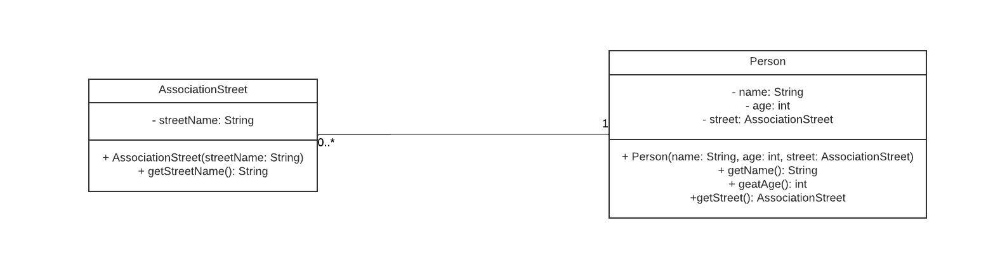
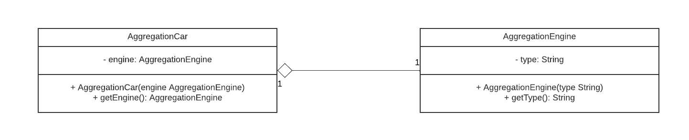
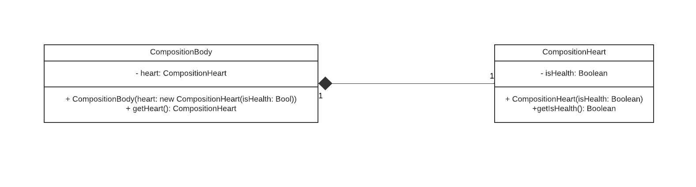
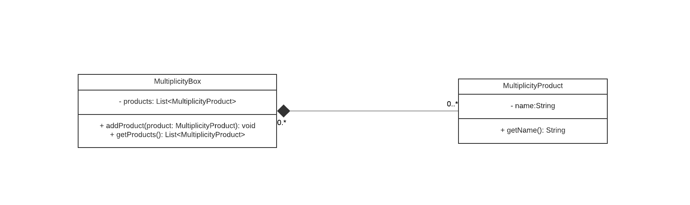

## Decomposition

### Association

Association is a relationship between two classes in object-oriented programming (OOP) that describes how they are connected to each other. It can be thought of as a "has-a" relationship, where one class has an instance of another class as a member variable.

Association is often used in decomposition, where a complex system is broken down into smaller, more manageable parts. Each part (class) is responsible for a specific aspect of the system, and the associations between the classes define how they work together to achieve the overall functionality.

## Aggregation

Aggregation is a form of object composition in object-oriented programming, where one object contains a reference to another object, but the contained object can exist independently of the containing object. In other words, the containing object is composed of one or more other objects.

Aggregation is often used to model relationships between objects in the real world, where one object has a "has-a" relationship with another object. For example, a car "has-a" engine, but the engine can exist independently of the car.

In Java, aggregation is typically implemented using instance variables that hold references to other objects.

## Composition

Composition is another form of object composition in object-oriented programming, where one object contains another object, but the contained object cannot exist independently of the containing object. In other words, the containing object owns the contained object and is responsible for its lifecycle.

Composition is often used to model relationships between objects in the real world, where one object is a part of another object. For example, a car "has-a" steering wheel, but the steering wheel cannot exist without the car.

In Java, composition is typically implemented using instance variables that hold references to other objects, and the contained object is created inside the constructor of the containing object.

## Multiplicity

In object-oriented programming, multiplicity refers to the number of objects that can be associated with another object in a particular relationship. It is often used to describe the relationship between classes in a UML class diagram.

For example, in a one-to-many relationship, one object of class A can be associated with many objects of class B. In this case, the multiplicity of class B is "many" and the multiplicity of class A is "one".

