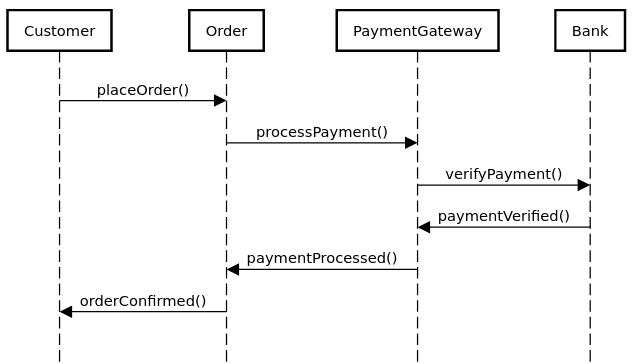

## UML Sequence Diagram

A UML sequence diagram is a type of diagram used in software engineering to visualize the interactions between objects or components in a system. It shows the flow of messages between objects over time, and can help developers understand the behavior and interactions of the system.

Here is an example of a UML sequence diagram for a simple system that processes customer orders:

```
Customer -> Order: placeOrder()
Order -> PaymentGateway: processPayment()
PaymentGateway -> Bank: verifyPayment()
Bank -> PaymentGateway: paymentVerified()
PaymentGateway -> Order: paymentProcessed()
Order -> Customer: orderConfirmed()
```


In this diagram, we have three objects: Customer, Order, and PaymentGateway. The diagram shows the sequence of events that occur when a customer places an order, including the messages that are passed between the objects.

The diagram starts with the Customer object sending a placeOrder() message to the Order object. The Order object then sends a processPayment() message to the PaymentGateway object, which in turn sends a verifyPayment() message to the Bank object. The Bank object responds with a paymentVerified() message to the PaymentGateway, which then sends a paymentProcessed() message to the Order object. Finally, the Order object sends an orderConfirmed() message to the Customer object.

This sequence diagram provides a clear visualization of the flow of events in this simple system, and can help developers identify potential issues or areas for improvement in the system's design or implementation.